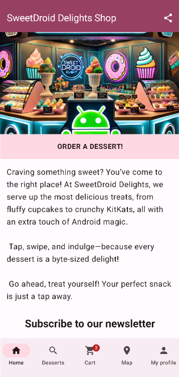
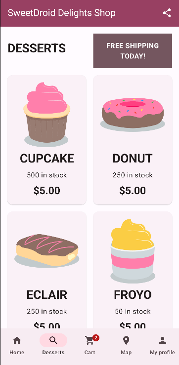
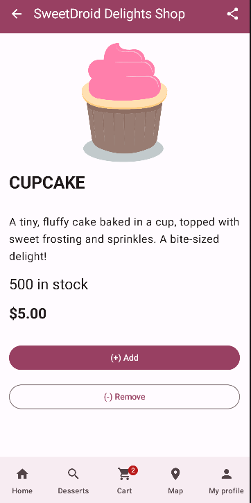
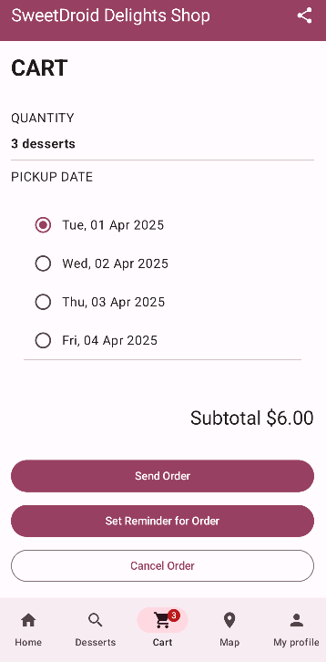

# 🍰 SweetDroid Delights – Android Dessert App

Welkom bij **SweetDroid Delights**, de starter-app voor het vak **Device Development**.

In deze module bouwen we stap voor stap een Android-app waarmee gebruikers desserts kunnen:
- bekijken
- toevoegen aan een winkelmandje
- bestellen
- een reminder krijgen
- een afhaalpunt instellen
- basisinstellingen aanpassen

De app wordt **geleidelijk uitgebreid** tijdens de input- en labosessies.

> ⚠️ Deze starter-app is **niet volledig**. 
> Tijdens de lessen en labo’s werk je elke week verder aan de app.


## 🎯 Doel van dit project

Met deze app leer je werken met:
- Kotlin & Android Studio
- Jetpack Compose
- Navigation
- ViewModel & UI state
- Persistent data (Room & DataStore)
- Messaging & background work
- Sensors, notifications & permissions
- Maps & intents
- Automatische testen & CI


## 📱 Overzicht van de app

### Home


- Welkomstscherm
- Startknop om te bestellen
- Optie om in te schrijven op een nieuwsbrief

### Desserts



- Overzicht van beschikbare desserts
- Detailpagina per dessert
- Product toevoegen aan winkelmandje

### Shopping Cart


- Overzicht van gekozen desserts
- Pickup-datum instellen
- Bestelling plaatsen
- Reminder instellen (notificatie)

### Pickup Location
- Scherm met afhaalpunten op een map
- *Beperkt uitgewerkt in de starter-app*

### Profile / Settings
- Instellingen van de gebruiker
- Aanpassen profielfoto en opslaan via DataStore
- Instellen User preferences zoals ingeschreven op nieuwsbrief, default pickup location, etc.
- Senor gerelateerde setting (enable automatic night mode)
- Notificiation settings (enable notifications voor order reminders en promotions)
- *Beperkt uitgewerkt*

## 🧱 Projectstructuur

De app gebruikt een **feature-based structuur**:

```
ui/
 ├── home
 ├── desserts
 ├── cart
 ├── settings
 └── navigation

data/
 ├── local
 ├── remote
 └── repository

domain/
 ├── model
 └── repository
```

Deze structuur is een globale basisstructuur en wordt uitgebreid tijdens de labosessies.


## 🧭 Navigatie & layout

- Jetpack Compose Navigation
- Eén centrale `NavGraph`
- Top App Bar
- Bottom Navigation Bar
- Niet alle navigatie is volledig afgewerkt in de starter


## 🧪 Testing & feedback

In dit project worden **automatische testen** gebruikt om feedback te geven.

### Soorten testen

#### Unit tests
- Testen logica (bv. ViewModel)
- Geen emulator nodig

```bash
./gradlew test
```

#### UI-tests (Compose)
- Testen wat zichtbaar is op het scherm
- Testen navigatie en interactie
- Emulator vereist

```bash
./gradlew pixel6Api34DebugAndroidTest
```

Groene testen = OK  
Rode testen = er ontbreekt functionaliteit of gedrag wijkt af.


## 📛 Naming conventions

### Composables
```kotlin
HomeScreen()
DessertsScreen()
CartScreen()
```

### ViewModels
```kotlin
CartViewModel
DessertsViewModel
```

### UI State
```kotlin
CartUiState
HomeUiState
```

### Test methodes
Gebruik het patroon:

```
<unit>_<scenario>_<expectedResult>
```

Voorbeeld:
```kotlin
clickingCartIcon_navigatesToCart()
```

## ⚙️ Gradle baseline

Deze configuratie ligt vast:
- Android Gradle Plugin 8.x
- compileSdk 34
- Jetpack Compose
- Hilt + KSP (geen kapt)

Wijzig deze instellingen niet zelfstandig.


## 🚀 Aan de slag

1. Open het project in **Android Studio (stable)**
2. Laat Gradle volledig syncen
3. Start de app op een emulator of fysiek toestel
4. Volg de labo-opdrachten per week
5. Run regelmatig de testen lokaal


## 📝 Opmerking

Deze app wordt gebruikt voor educatieve doeleinden. Onvolledigheden of TODO’s zijn normaal.

Veel succes en experimenteer regelmatig 🚀
